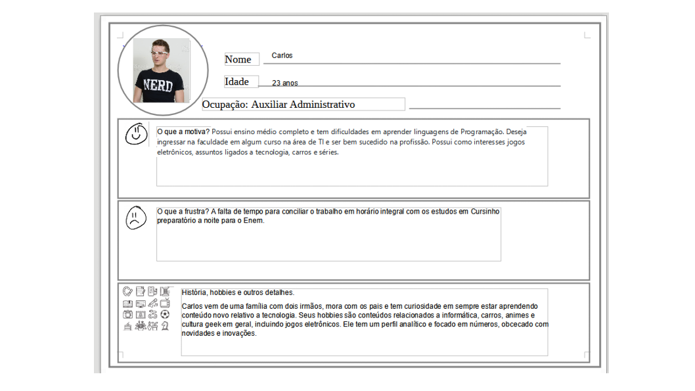

# Informações do Projeto
`TÍTULO DO PROJETO`  

Programalçao em C#

`CURSO` 

Sistemas de Informação

## Participantes

> Os membros do grupo são: 
> - Arthur Souza Armond
> - Arthur do Amaral Esteves
> - Arthur Fernandes Silva Araujo
> - Danilo Cesar Hort

# Estrutura do Documento

- [Informações do Projeto](#informações-do-projeto)
  - [Participantes](#participantes)
- [Estrutura do Documento](#estrutura-do-documento)
- [Introdução](#introdução)
  - [Problema](#problema)
  - [Objetivos](#objetivos)
  - [Público-Alvo](#público-alvo)
- [Especificações do Projeto](#especificações-do-projeto)
  - [Personas](#personas)
  - [Histórias de Usuários](#histórias-de-usuários)
  - [Requisitos](#requisitos)
- [Projeto da Solução](#projeto-da-solução)
  - [Wireframes](#wireframes)
  - [Mapa de navegação](#mapa-de-navegação)
- [Conclusões](#avaliação-da-aplicação)
  
# Introdução

## Problema

Demanda de jovens que não possuem acesso ao
aprendizado de Linguagens de Programação.
A falta de qualificação de jovens na área de TI.
Nas nossas pesquisas observamos que existe uma
demanda maior por profissionais de TI do que a oferta
disponível no mercado de trabalho.
## Objetivos

> 
> **Link Útil**:
> - [Objetivo geral e objetivo específico: como fazer e quais verbos utilizar](https://blog.mettzer.com/diferenca-entre-objetivo-geral-e-objetivo-especifico/)

## Público-Alvo

Clientes: O público alvo será composto por jovens e jovens que desejam começar a aprender sobre programação 
 
# Especificações do Projeto

A arquitetura Web do site será desenvolvida com as
linguagens HTML, CSS e Javascript.
O site terá conteúdo sobre a linguagem C# em nível
básico, intermediário e avançado

## Personas

•Nome: Carlos
•Idade: 23 anos
•Ocupação: Auxiliar Administrativo.
•Motivações: Estudante do primeiro ano de Sistemas de
Informação, tem dificuldades com as linguagens de
Programação.
•Formar-se e ser bem sucedido na profissão.
> **Exemplo de Ficha**
> 
 

## Histórias de Usuários

Com base na análise das personas forma identificadas as seguintes histórias de usuários:

|EU COMO... ` Carlos`     | QUERO/PRECISO ... `•Formar-se na faculdade.                     ||PARA ... `ser bem sucedido ma profissão`|
|--------------------     |------------------------------------                              |----------------------------------------|
|Estudante do primeiro ano|                                                                  |Lembrar de fazer as atividaes,para poder|
de Sistemas deInformação, |                                                                  |desenvolver a lógica de progrmação para |
tem dificuldadescom as    |                                                                  |melhor aprender outras linguagens de    |
linguagens de Programação | Asisitir videos aulas para tirar minhas dúvidas,fazer exerícios  |programação.                            |
|                         | poder fixar a matéria aprendida em sala na faculdade.            |                                        |

## Requisitos

A tabela que segue apresenta os requisitos funcionais do projeto. 

### Requisitos Funcionais

|ID    | Descrição do Requisito  | Prioridade |
|------|-----------------------------------------|----|
|RF-001| Um design centrado no usuário.          | ALTA | 
|RF-002|Conteúdos nos níveis básico,intermediário|
       |avançado relacionados a linguagem C#|    | ALTA |
|RF-003| O site deve ter um design atrativo,     | MÉDIA |
       | para pessoas jovens                     |

# Projeto da Solução

A arquitetura Web do site será desenvolvida com as
linguagens HTML, CSS e Javascript.
O site terá conteúdo sobre a linguagem C# em nível
básico, intermediário e avançado
Clientes: O público alvo será composto por jovens
universitários dos cursos de TI.

## Wireframes
Utilizamos uma site com tom mais claro poruqe percebemos que assim o site fica mais adaptavel para o nosso público alvo,
no site existem áreas dívididas entre tarefas,aulas,cursos, entr outros para facilitar a navegação do úsuario pelo site. 

> 
> **Links Úteis**:
> - [Ferramentas de Wireframes](https://rockcontent.com/blog/wireframes/)
> - [Figma](https://www.figma.com/)
> - [Adobe XD](https://www.adobe.com/br/products/xd.html#scroll)
> - [MarvelApp](https://marvelapp.com/developers/documentation/tutorials/)
> 
> **Exemplo**:
> 
> 

## Mapa de navegação

......  COLOQUE AQUI O SEU TEXTO OU DIAGRAMA DE NAVEGAÇÃO .......

> Inclua uma descrição textual ou um diagrama mostrando, sequencialmente, quais ações
> um usuário deve realizar para utilizar todas as características do seu sistema. 

> **Exemplo de Diagrama (opcional, pode ser em texto)**
> 

# Conclusões

Decidimos fazer um site na intenção de ensinar e ajudar a tirar dúvidas sobre a linguagem C#, e escolhemos ela porque possui custo menor e mais seguro em relação a outras linguagens Sistema de cache viável e simples grande comunidade online Código compilado em linguagem padrão, independentemente do sistema Operacional e arquitetura de destino.

